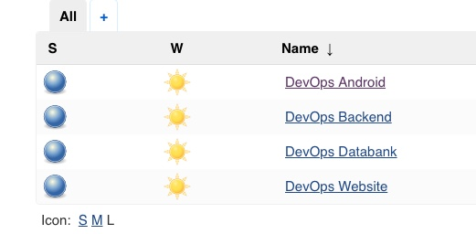
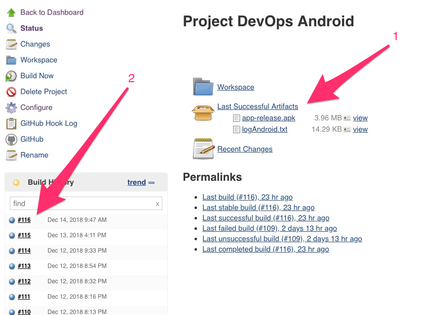
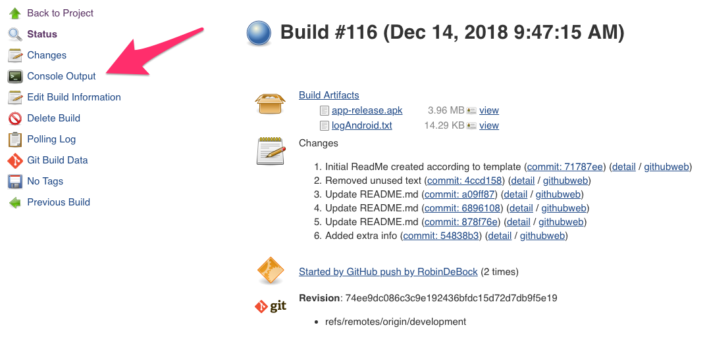
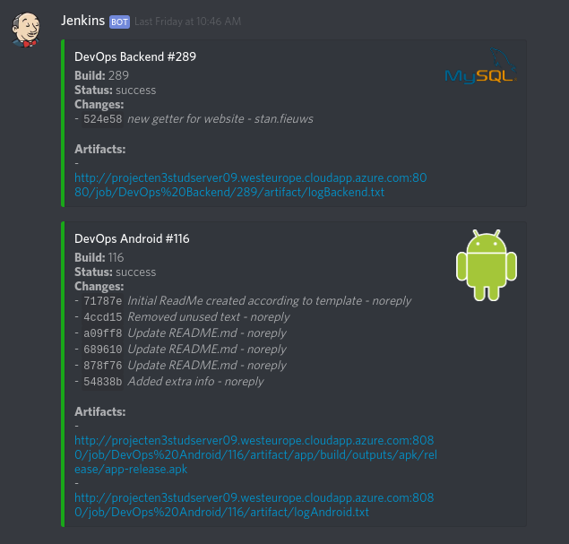

# How To Guide for Developers

## Login to Jenkins
* Login
  * [Link to site](projecten3studserver09.westeurope.cloudapp.azure.com:8080)
  * Credentials:
    * Usernaam: student
    * Wachtwoord: StudentStudent18

## Logs en downloads via Jenkins

* Kies één van de nodes

* Kies een optie

  1. Dowload een artifact van de laatste succesvolle build
  2. Bekijk een build
    * Kies Console Output
      * Hier kan je vinden:
        * Door wie de build gestart is
        * Welke commit van toepassing is
        * Eventuele fouten in build
        * Of de upload naar Google Play Store Gelukt is
    

3. De artifacten zijn ook beschikbaar op de private discord van de groep. Daar kan je ook nachecken of een build succesvol was, of niet.

4. Uiteindelijk is de app beschikbaar op de playstore via deze [link](https://play.google.com/apps/internaltest/4701576184446152344)