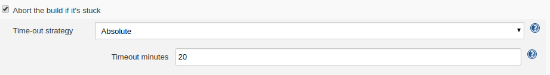

# Jenkins - Website

## Nodejs

1. Install node and nodejs

   ```bash
   sudo apt-get install node
   sudo apt-get install nodejs
   ```
## Jenkins build jobs
* Aanmaken van Freestyle Project

  * build is parameterized [x]

* Build

  1. Eerst kijken we of er al een process van de website draait, indien ja sluiten we het af:

     ```bash
     #!/bin/bash
     ps -ef  | grep "ng serve"
     for id in $(ps -ef | grep "ng serve" | grep -v "grep" | awk '{print $2}'); do
         echo ${id} && \
         kill -9 ${id}
     done || true
     ```

  2. Daarna gaan we de nodige packages installen:

     ```bash
     npm install
     ```

  3. Hierna zorgen we dat het process, dat aangemaakt wordt door jenkins, niet afsluit zodra de job gedaan is:

     ```bash
     export BUILD_ID=dontKillMe
     ```

  4. Door een probleem dat het build commando soms genegeerd werd, zorgen we ervoor dat hij gaat blijven proberen builden, zolang het process niet draait:

     ```bash
     #!/bin/bash
     
     ps -ef | grep "ng serve --proxy-config proxy.conf.json --host 0.0.0.0 --disable-host-check" | grep -v "grep" > frontendConnected.txt
     until [ -s frontendConnected.txt ]
     	do
     		#(cd "/var/lib/jenkins/workspace/DevOps Website/"; ng serve --proxy-config proxy.conf.json --host 0.0.0.0 --disable-host-check) &
     		(cd "/var/lib/jenkins/workspace/DevOps Website/"; ng serve --proxy-config proxy.conf.json --host 0.0.0.0 --disable-host-check > "/var/lib/jenkins/workspace/DevOps Website/logWebsite.txt") &
     		sleep 90
     		ps -ef | grep "ng serve --proxy-config proxy.conf.json --host 0.0.0.0 --disable-host-check" | grep -v "grep" > frontendConnected.txt
     	done
     ```

  5. Als er nu een probleem in zit, blijft de job draaien. Dit lossen we op door een timer te zetten op de job, indien de timer overschreden wordt sluit de job af met een error.

     

# Post-build

*  Artifact van de log meegeven

```
logWebsite.txt
```

* Discord notifier
  * Bot die in discord builds toont (fail/succes) met gearchiveerde bestanden (logs)


